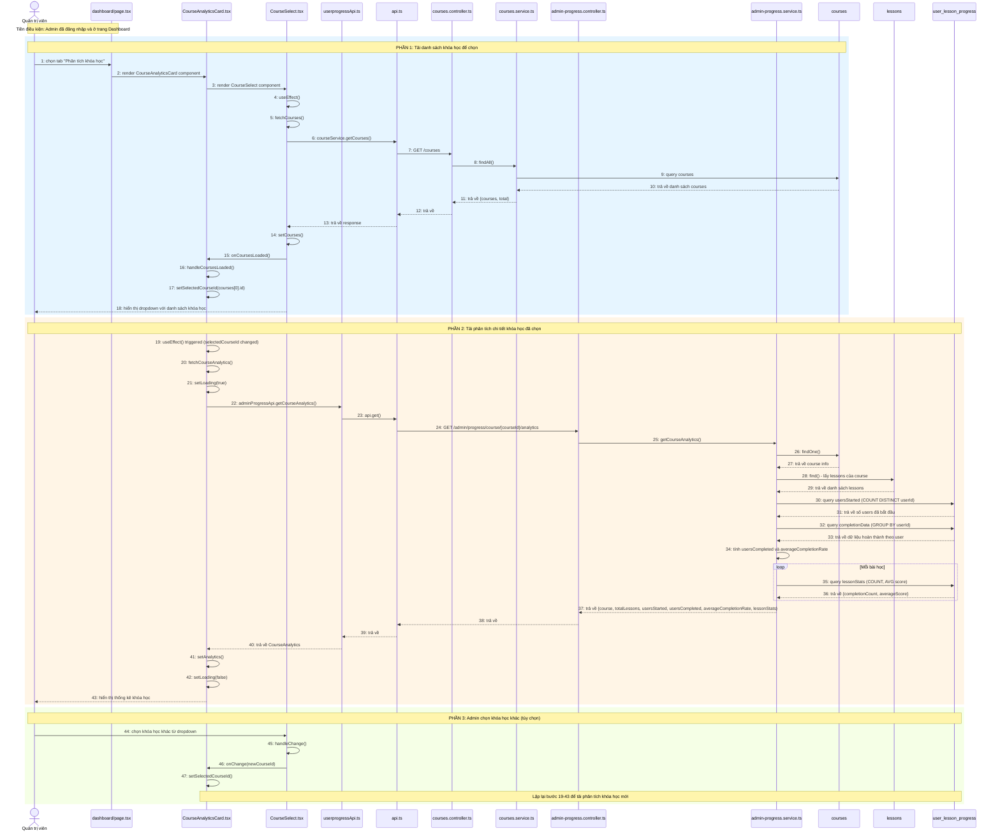

# Sequence Diagram: Xem phân tích theo khóa học (Course Analytics)

## Use Case: Xem phân tích theo khóa học

### Mô tả
Admin truy cập trang Dashboard, chọn tab "Phân tích khóa học", chọn một khóa học từ dropdown để xem thống kê chi tiết bao gồm: tổng bài học, số người bắt đầu/hoàn thành, tỷ lệ hoàn thành, và thống kê từng bài học.

### Sequence Diagram

---

## Tổng hợp các thành phần

### Frontend (Admin)

| File | Vai trò |
|------|---------|
| `dashboard/page.tsx` | Trang Dashboard chính, chứa các tabs |
| `CourseAnalyticsCard.tsx` | Card hiển thị phân tích khóa học |
| `CourseSelect.tsx` | Component dropdown chọn khóa học |
| `userprogressApi.ts` | Service gọi API liên quan đến progress |
| `api.ts` | Core API utility functions |

### Backend (BE)

| File | Vai trò |
|------|---------|
| `courses.controller.ts` | Controller xử lý các endpoints /courses/* |
| `courses.service.ts` | Service logic nghiệp vụ cho courses |
| `admin-progress.controller.ts` | Controller xử lý các endpoints admin/progress/* |
| `admin-progress.service.ts` | Service logic nghiệp vụ cho admin progress |

### Entities

| Entity | Table | Mô tả |
|--------|-------|-------|
| `Courses` | `courses` | Thông tin khóa học |
| `Lessons` | `lessons` | Thông tin bài học |
| `UserLessonProgress` | `user_lesson_progress` | Tiến trình học của user |

### API Endpoints

| Method | Endpoint | Mô tả |
|--------|----------|-------|
| GET | `/courses?page=1&limit=100` | Lấy danh sách khóa học |
| GET | `/admin/progress/course/{courseId}/analytics` | Lấy phân tích chi tiết khóa học |

### Dữ liệu trả về (CourseAnalytics)

| Field | Type | Mô tả |
|-------|------|-------|
| `course` | Object | Thông tin khóa học (id, title, hskLevel) |
| `totalLessons` | number | Tổng số bài học |
| `usersStarted` | number | Số người đã bắt đầu học |
| `usersCompleted` | number | Số người đã hoàn thành tất cả bài |
| `averageCompletionRate` | number | Tỷ lệ hoàn thành trung bình (%) |
| `lessonStats` | Array | Thống kê từng bài học (lessonId, lessonTitle, completionCount, averageScore) |
