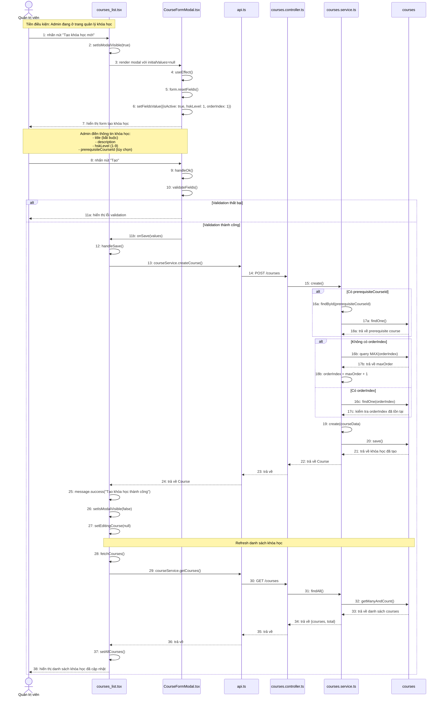

# Sequence Diagram: Tạo khóa học (Create Course)

## Use Case: Tạo khóa học mới

### Mô tả
Admin truy cập trang quản lý khóa học, nhấn nút "Tạo khóa học mới", điền thông tin vào form và lưu khóa học mới vào hệ thống.

### Sequence Diagram

---

## Tổng hợp các thành phần

### Frontend (Admin)

| File | Vai trò |
|------|---------|
| `courses_list.tsx` | Trang quản lý danh sách khóa học |
| `CourseFormModal.tsx` | Modal form tạo/sửa khóa học |
| `api.ts` | Service gọi API (courseService) |

### Backend (BE)

| File | Vai trò |
|------|---------|
| `courses.controller.ts` | Controller xử lý các endpoints /courses/* |
| `courses.service.ts` | Service logic nghiệp vụ cho courses |

### Entity

| Entity | Table | Mô tả |
|--------|-------|-------|
| `Courses` | `courses` | Thông tin khóa học |

### API Endpoints

| Method | Endpoint | Mô tả |
|--------|----------|-------|
| POST | `/courses` | Tạo khóa học mới |
| GET | `/courses?page=1&limit=100` | Lấy danh sách khóa học |

### Dữ liệu đầu vào (CreateCourseDto)

| Field | Type | Required | Mô tả |
|-------|------|----------|-------|
| `title` | string | ✅ | Tiêu đề khóa học |
| `description` | string | ❌ | Mô tả khóa học |
| `hskLevel` | number (1-9) | ✅ | Cấp độ HSK |
| `prerequisiteCourseId` | number | ❌ | ID khóa học tiên quyết |
| `orderIndex` | number | ❌ | Thứ tự hiển thị (auto-increment nếu không có) |
| `isActive` | boolean | ❌ | Trạng thái hoạt động (default: true) |

### Validation và Logic BE

1. **Kiểm tra prerequisite course**: Nếu có `prerequisiteCourseId`, kiểm tra course đó có tồn tại không
2. **Auto-increment orderIndex**: Nếu không có `orderIndex`, tự động lấy MAX + 1
3. **Kiểm tra orderIndex trùng**: Nếu có `orderIndex`, kiểm tra không bị trùng
