# Sequence Diagram: Tạo mẫu ngữ pháp mới (Create Grammar Pattern)

## Use Case: Tạo mẫu ngữ pháp mới

### Mô tả
Admin truy cập trang quản lý ngữ pháp, nhấn nút "Tạo Mẫu Ngữ Pháp Mới", điền thông tin mẫu ngữ pháp bao gồm pattern, pinyin, công thức, điểm ngữ pháp, giải thích và các ví dụ, sau đó lưu vào hệ thống.

### Sequence Diagram

```mermaid
sequenceDiagram
    actor Admin as Quản trị viên
    participant GrammarListTsx as grammarList.tsx
    participant GrammarFormModal as GrammarFormModal.tsx
    participant GrammarApi as grammarApi.ts
    participant Api as api.ts
    participant Controller as grammar-patterns.controller.ts
    participant Service as grammar-patterns.service.ts
    participant PatternEntity as grammar_patterns
    participant TranslationEntity as grammar_translations

    Note over Admin,GrammarListTsx: Tiền điều kiện: Admin đang ở trang quản lý ngữ pháp

    %% ===== PHẦN 1: MỞ FORM =====
    rect rgb(230, 245, 255)
    Note over Admin,GrammarFormModal: PHẦN 1: Mở form tạo mẫu ngữ pháp
    
    Admin->>GrammarListTsx: 1: nhấn nút "Tạo Mẫu Ngữ Pháp Mới"
    GrammarListTsx->>GrammarListTsx: 2: handleCreate()
    GrammarListTsx->>GrammarListTsx: 3: setEditingPattern(null)
    GrammarListTsx->>GrammarListTsx: 4: setModalVisible(true)
    GrammarListTsx->>GrammarFormModal: 5: render modal với initialData=null
    GrammarFormModal->>GrammarFormModal: 6: useEffect()
    GrammarFormModal->>GrammarFormModal: 7: form.setFieldsValue(getInitialValues())
    GrammarFormModal-->>Admin: 8: hiển thị form tạo mẫu ngữ pháp
    end

    %% ===== PHẦN 2: ĐIỀN THÔNG TIN MẪU CÂU =====
    rect rgb(255, 250, 230)
    Note over Admin,GrammarFormModal: PHẦN 2: Điền thông tin mẫu câu (Step 1)

    Admin->>GrammarFormModal: 9: nhập mẫu câu tiếng Trung
    GrammarFormModal->>GrammarFormModal: 10: handlePatternChange()
    GrammarFormModal->>GrammarFormModal: 11: generatePinyin() - sử dụng thư viện pinyin-pro
    GrammarFormModal->>GrammarFormModal: 12: form.setFieldsValue({patternPinyin})
    GrammarFormModal-->>Admin: 13: hiển thị pinyin tự động tạo
    
    Admin->>GrammarFormModal: 14: nhập/chỉnh sửa công thức mẫu
    Admin->>GrammarFormModal: 15: chọn cấp HSK
    end

    %% ===== PHẦN 3: ĐIỀN GIẢI THÍCH VÀ DỊCH NGHĨA =====
    rect rgb(230, 255, 230)
    Note over Admin,GrammarFormModal: PHẦN 3: Điền giải thích và dịch nghĩa (Step 2)
    
    Admin->>GrammarFormModal: 16: nhập điểm ngữ pháp
    Admin->>GrammarFormModal: 17: nhập giải thích chi tiết
    end

    %% ===== PHẦN 4: THÊM VÍ DỤ MINH HỌA =====
    rect rgb(255, 240, 230)
    Note over Admin,GrammarFormModal: PHẦN 4: Thêm ví dụ minh họa (Step 3)
    
    loop Mỗi ví dụ
        Admin->>GrammarFormModal: 18: nhập câu tiếng Trung ví dụ
        GrammarFormModal->>GrammarFormModal: 19: handleExampleChineseChange()
        GrammarFormModal->>GrammarFormModal: 20: generatePinyin()
        GrammarFormModal->>GrammarFormModal: 21: cập nhật pinyin cho ví dụ
        Admin->>GrammarFormModal: 22: nhập dịch nghĩa tiếng Việt
        Admin->>GrammarFormModal: 23: nhấn "Thêm ví dụ khác" (nếu cần)
        GrammarFormModal->>GrammarFormModal: 24: add() - thêm field mới
    end
    end

    %% ===== PHẦN 5: SUBMIT FORM =====
    rect rgb(255, 245, 230)
    Note over Admin,TranslationEntity: PHẦN 5: Lưu mẫu ngữ pháp vào database

    Admin->>GrammarFormModal: 25: nhấn nút "Tạo Mới"
    GrammarFormModal->>GrammarFormModal: 26: handleSubmit()
    GrammarFormModal->>GrammarFormModal: 27: form.validateFields()
    
    alt Validation thất bại
        GrammarFormModal-->>Admin: 28a: hiển thị lỗi validation
    else Validation thành công
        GrammarFormModal->>GrammarFormModal: 28b: xử lý formData
        GrammarFormModal->>GrammarFormModal: 29: tạo patternArray từ pattern.split()
        GrammarFormModal->>GrammarFormModal: 30: tạo pinyinArray từ patternPinyin.split()
        GrammarFormModal->>GrammarFormModal: 31: xử lý examples array
        GrammarFormModal->>GrammarListTsx: 32: onSubmit(formData)
        
        GrammarListTsx->>GrammarListTsx: 33: handleSubmit()
        GrammarListTsx->>GrammarListTsx: 34: validate required fields
        GrammarListTsx->>GrammarListTsx: 35: tạo formData cho API
        GrammarListTsx->>GrammarApi: 36: createCompleteGrammarPattern()
        GrammarApi->>Api: 37: api.post()
        Api->>Controller: 38: POST /grammar-patterns/complete
        Controller->>Service: 39: createComplete()
        
        Note over Service,PatternEntity: Tạo GrammarPattern mới
        Service->>Service: 40: create(patternData)
        Service->>PatternEntity: 41: save()
        PatternEntity-->>Service: 42: trả về pattern với id
        
        Note over Service,TranslationEntity: Tạo GrammarTranslation
        Service->>Service: 43: create(translationData)
        Service->>TranslationEntity: 44: save()
        TranslationEntity-->>Service: 45: trả về translation
        
        Service->>Service: 46: findOne(patternId)
        Service->>PatternEntity: 47: findOne() với relations
        PatternEntity-->>Service: 48: trả về complete pattern
        
        Service-->>Controller: 49: trả về GrammarPattern
        Controller-->>Api: 50: trả về
        Api-->>GrammarApi: 51: trả về
        GrammarApi-->>GrammarListTsx: 52: trả về GrammarPattern
        GrammarListTsx->>GrammarListTsx: 53: message.success("Tạo mẫu ngữ pháp thành công!")
        GrammarListTsx->>GrammarListTsx: 54: setModalVisible(false)
        GrammarListTsx->>GrammarListTsx: 55: setEditingPattern(null)
    end
    end

    %% ===== PHẦN 6: REFRESH DANH SÁCH =====
    rect rgb(245, 255, 230)
    Note over GrammarListTsx,PatternEntity: PHẦN 6: Refresh danh sách ngữ pháp
    
    GrammarListTsx->>GrammarListTsx: 56: fetchData()
    GrammarListTsx->>GrammarApi: 57: getAllGrammarPatterns()
    GrammarApi->>Api: 58: api.get()
    Api->>Controller: 59: GET /grammar-patterns
    Controller->>Service: 60: findAll()
    Service->>PatternEntity: 61: getManyAndCount()
    PatternEntity-->>Service: 62: trả về danh sách patterns
    Service-->>Controller: 63: trả về {patterns, total, page, limit}
    Controller-->>Api: 64: trả về
    Api-->>GrammarApi: 65: trả về
    GrammarApi-->>GrammarListTsx: 66: trả về
    GrammarListTsx->>GrammarListTsx: 67: setData(), setPagination()
    GrammarListTsx-->>Admin: 68: hiển thị danh sách ngữ pháp đã cập nhật
    end
```

---

## Tổng hợp các thành phần

### Frontend (Admin)

| File | Vai trò |
|------|---------|
| `grammarList.tsx` | Trang quản lý danh sách mẫu ngữ pháp |
| `GrammarFormModal.tsx` | Modal form tạo/sửa mẫu ngữ pháp |
| `grammarApi.ts` | Service gọi API liên quan đến grammar |
| `api.ts` | Core API utility functions |

### Backend (BE)

| File | Vai trò |
|------|---------|
| `grammar-patterns.controller.ts` | Controller xử lý các endpoints /grammar-patterns/* |
| `grammar-patterns.service.ts` | Service logic nghiệp vụ cho grammar patterns |

### Entities

| Entity | Table | Mô tả |
|--------|-------|-------|
| `GrammarPattern` | `grammar_patterns` | Thông tin mẫu ngữ pháp (pattern, patternPinyin, patternFormula, hskLevel) |
| `GrammarTranslation` | `grammar_translations` | Bản dịch và giải thích (language, grammarPoint, explanation, example) |

### API Endpoints

| Method | Endpoint | Mô tả |
|--------|----------|-------|
| POST | `/grammar-patterns/complete` | Tạo mẫu ngữ pháp hoàn chỉnh (pattern + translation) |
| GET | `/grammar-patterns` | Lấy danh sách mẫu ngữ pháp |

### Dữ liệu đầu vào (CreateCompleteGrammarPatternDto)

| Field | Type | Required | Mô tả |
|-------|------|----------|-------|
| `pattern.pattern` | string[] | ✅ | Mảng các từ trong mẫu câu |
| `pattern.patternPinyin` | string[] | ❌ | Mảng phiên âm pinyin |
| `pattern.patternFormula` | string | ❌ | Công thức mẫu (VD: A + 帮 + B) |
| `pattern.hskLevel` | number | ❌ | Cấp độ HSK (1-9) |
| `translation.language` | string | ❌ | Ngôn ngữ dịch (default: "vn") |
| `translation.grammarPoint` | string | ✅ | Điểm ngữ pháp chính |
| `translation.explanation` | string | ✅ | Giải thích chi tiết |
| `translation.example` | Array | ❌ | Mảng các ví dụ minh họa |
| `translation.example[].chinese` | string[] | ❌ | Câu tiếng Trung (chia thành mảng ký tự) |
| `translation.example[].pinyin` | string[] | ❌ | Phiên âm pinyin của ví dụ |
| `translation.example[].translation` | string | ❌ | Dịch nghĩa tiếng Việt |

### Logic đặc biệt

1. **Auto-generate Pinyin**: Sử dụng thư viện `pinyin-pro` để tự động tạo pinyin khi nhập mẫu câu hoặc ví dụ
2. **Dynamic Examples**: Hỗ trợ thêm/xóa nhiều ví dụ minh họa sử dụng `Form.List`
3. **Pattern Split**: Pattern được split thành mảng các từ cách nhau bởi dấu cách
4. **Example Chinese Split**: Câu tiếng Trung trong ví dụ được split thành mảng từng ký tự
5. **Two Scenarios trong BE**:
   - Nếu không có `patternId`: Tạo mới cả pattern và translation
   - Nếu có `patternId`: Thêm translation cho pattern đã có
