# Sequence Diagram: Tạo từ vựng mới (Create Word)

## Use Case: Tạo từ vựng mới

### Mô tả
Admin truy cập trang quản lý từ vựng, nhấn nút "Thêm Từ Mới", điền thông tin từ vựng bao gồm chữ Hán, pinyin, nghĩa, bản dịch và tải lên hình ảnh/âm thanh (tùy chọn), sau đó lưu từ mới vào hệ thống.

### Sequence Diagram

```mermaid
sequenceDiagram
    actor Admin as Quản trị viên
    participant WordsPageTsx as words/page.tsx
    participant WordForm as WordForm.tsx
    participant S3Upload as s3Upload.ts
    participant S3 as AWS S3
    participant TTSButton as TTSButton.tsx
    participant WordApi as wordApi.ts
    participant Api as api.ts
    participant Controller as words.controller.ts
    participant Service as words.service.ts
    participant WordEntity as words
    participant SenseEntity as word_senses
    participant TranslationEntity as word_sense_translations

    Note over Admin,WordsPageTsx: Tiền điều kiện: Admin đang ở trang quản lý từ vựng

    %% ===== PHẦN 1: MỞ FORM =====
    rect rgb(230, 245, 255)
    Note over Admin,WordForm: PHẦN 1: Mở form tạo từ vựng
    
    Admin->>WordsPageTsx: 1: nhấn nút "Thêm Từ Mới"
    WordsPageTsx->>WordsPageTsx: 2: setCreateModalVisible(true)
    WordsPageTsx->>WordForm: 3: render modal với wordData=undefined
    WordForm->>WordForm: 4: useEffect()
    WordForm->>WordForm: 5: form.resetFields()
    WordForm-->>Admin: 6: hiển thị form tạo từ vựng
    end

    %% ===== PHẦN 2: NHẬP CHỮ HÁN VÀ TỰ ĐỘNG TẠO PINYIN =====
    rect rgb(255, 250, 230)
    Note over Admin,WordEntity: PHẦN 2: Nhập chữ Hán và tự động tạo Pinyin

    Admin->>WordForm: 7: nhập chữ Hán giản thể
    WordForm->>WordForm: 8: handleSimplifiedInput()
    WordForm->>WordForm: 9: handleSimplifiedChange()
    WordForm->>WordForm: 10: generatePinyin() - sử dụng thư viện pinyin-pro
    WordForm->>WordForm: 11: setGeneratedPinyin()
    WordForm->>WordForm: 12: form.setFieldsValue(pinyin)
    
    Note over WordForm,WordEntity: Kiểm tra từ đã tồn tại (debounce 500ms)
    WordForm->>WordForm: 13: handleSimplifiedSearch()
    WordForm->>WordApi: 14: searchWord()
    WordApi->>Api: 15: api.get()
    Api->>Controller: 16: GET /words/search?simplified=...
    Controller->>Service: 17: search()
    Service->>WordEntity: 18: findOne()
    WordEntity-->>Service: 19: trả về kết quả
    Service-->>Controller: 20: trả về {exists, word}
    Controller-->>Api: 21: trả về
    Api-->>WordApi: 22: trả về
    WordApi-->>WordForm: 23: trả về WordSearchResponse
    
    alt Từ đã tồn tại
        WordForm->>WordForm: 24a: setExistingWord(word)
        WordForm-->>Admin: 25a: hiển thị Alert "Từ đã tồn tại"
    else Từ chưa tồn tại
        WordForm->>WordForm: 24b: setExistingWord(null)
    end
    end

    %% ===== PHẦN 3: UPLOAD HÌNH ẢNH (TÙY CHỌN) =====
    rect rgb(230, 255, 230)
    Note over Admin,S3: PHẦN 3: Upload hình ảnh minh họa (tùy chọn)
    
    Admin->>WordForm: 25: chọn file hình ảnh
    WordForm->>WordForm: 26: handleImageFileChange()
    WordForm->>WordForm: 27: setSelectedImageFile()
    Admin->>WordForm: 28: nhấn nút "Tải lên S3"
    WordForm->>WordForm: 29: handleUploadImage()
    WordForm->>WordForm: 30: validateFile() - kiểm tra định dạng và kích thước
    WordForm->>WordForm: 31: setUploadModalVisible(true)
    WordForm->>WordForm: 32: setUploadStatus("uploading")
    WordForm->>S3Upload: 33: uploadImageByType()
    S3Upload->>S3: 34: upload file to S3
    S3-->>S3Upload: 35: trả về URL
    S3Upload-->>WordForm: 36: trả về {success, url}
    WordForm->>WordForm: 37: setUploadedImageUrl()
    WordForm->>WordForm: 38: form.setFieldsValue({imageUrl})
    WordForm->>WordForm: 39: setUploadStatus("success")
    WordForm-->>Admin: 40: hiển thị preview hình ảnh đã upload
    end

    %% ===== PHẦN 4: TẠO ÂM THANH TTS HOẶC UPLOAD (TÙY CHỌN) =====
    rect rgb(255, 240, 230)
    Note over Admin,S3: PHẦN 4: Tạo âm thanh TTS hoặc Upload (tùy chọn)
    
    alt Sử dụng TTS (Text-to-Speech)
        Admin->>TTSButton: 41a: nhấn nút TTS
        TTSButton->>TTSButton: 42a: generateTTS() - gọi API TTS
        TTSButton-->>WordForm: 43a: onAudioGenerated(audioUrl)
        WordForm->>WordForm: 44a: handleTTSGenerated()
        WordForm->>WordForm: 45a: fetch audio blob
        WordForm->>WordForm: 46a: tạo File từ blob
        WordForm->>WordForm: 47a: setSelectedAudioFile()
        WordForm-->>Admin: 48a: message "Đã tạo âm thanh TTS"
    else Upload file âm thanh
        Admin->>WordForm: 41b: chọn file âm thanh
        WordForm->>WordForm: 42b: handleAudioFileChange()
        WordForm->>WordForm: 43b: setSelectedAudioFile()
    end
    
    Admin->>WordForm: 49: nhấn nút "Tải lên S3" (cho audio)
    WordForm->>WordForm: 50: handleUploadAudio()
    WordForm->>WordForm: 51: validateFile() - kiểm tra định dạng audio
    WordForm->>WordForm: 52: setUploadStatus("uploading")
    WordForm->>S3Upload: 53: uploadAudioByType()
    S3Upload->>S3: 54: upload file to S3
    S3-->>S3Upload: 55: trả về URL
    S3Upload-->>WordForm: 56: trả về {success, url}
    WordForm->>WordForm: 57: setUploadedAudioUrl()
    WordForm->>WordForm: 58: form.setFieldsValue({audioUrl})
    WordForm->>WordForm: 59: setUploadStatus("success")
    WordForm-->>Admin: 60: hiển thị audio player
    end

    %% ===== PHẦN 5: SUBMIT FORM =====
    rect rgb(255, 245, 230)
    Note over Admin,TranslationEntity: PHẦN 5: Lưu từ vựng vào database

    Admin->>WordForm: 61: nhấn nút "Lưu"
    WordForm->>WordForm: 62: handleSubmit()
    WordForm->>WordForm: 63: validateFields()
    
    alt Validation thất bại
        WordForm-->>Admin: 64a: hiển thị lỗi validation
    else Validation thành công
        WordForm->>WordForm: 64b: setLoading(true)
        WordForm->>WordForm: 65: tạo formData với uploadedImageUrl, uploadedAudioUrl
        WordForm->>WordApi: 66: createWord()
        WordApi->>Api: 67: api.post()
        Api->>Controller: 68: POST /words
        Controller->>Service: 69: createComplete()
        
        alt wordId không có (tạo từ mới)
            Service->>WordEntity: 70: findOne() - kiểm tra trùng
            WordEntity-->>Service: 71: trả về null
            Service->>Service: 72: create(wordData)
            Service->>WordEntity: 73: save()
            WordEntity-->>Service: 74: trả về word với id
        end
        
        Service->>Service: 75: getNextSenseNumber()
        Service->>SenseEntity: 76: query MAX(senseNumber)
        SenseEntity-->>Service: 77: trả về maxNumber
        
        Service->>Service: 78: create(senseData với imageUrl, audioUrl)
        Service->>SenseEntity: 79: save()
        SenseEntity-->>Service: 80: trả về wordSense với id
        
        Service->>Service: 81: create(translationData)
        Service->>TranslationEntity: 82: save()
        TranslationEntity-->>Service: 83: trả về translation
        
        Service->>Service: 84: findById()
        Service->>WordEntity: 85: findOne() với relations
        WordEntity-->>Service: 86: trả về complete word
        
        Service-->>Controller: 87: trả về Word
        Controller-->>Api: 88: trả về
        Api-->>WordApi: 89: trả về
        WordApi-->>WordForm: 90: trả về Word
        WordForm->>WordForm: 91: message.success("Tạo từ vựng thành công")
        WordForm->>WordsPageTsx: 92: onSuccess()
    end
    end
    
    %% ===== PHẦN 6: REFRESH DANH SÁCH =====
    rect rgb(245, 255, 230)
    Note over WordsPageTsx,WordEntity: PHẦN 6: Refresh danh sách từ vựng
    
    WordsPageTsx->>WordsPageTsx: 93: handleFormSuccess()
    WordsPageTsx->>WordsPageTsx: 94: setCreateModalVisible(false)
    WordsPageTsx->>WordsPageTsx: 95: fetchWordData()
    WordsPageTsx->>WordApi: 96: fetchWords()
    WordApi->>Api: 97: api.get()
    Api->>Controller: 98: GET /words
    Controller->>Service: 99: findAll()
    Service->>WordEntity: 100: getManyAndCount()
    WordEntity-->>Service: 101: trả về danh sách words
    Service-->>Controller: 102: trả về {words, total}
    Controller-->>Api: 103: trả về
    Api-->>WordApi: 104: trả về
    WordApi-->>WordsPageTsx: 105: trả về
    WordsPageTsx->>WordsPageTsx: 106: setWords()
    WordsPageTsx-->>Admin: 107: hiển thị danh sách từ vựng đã cập nhật
    end
```

---

## Tổng hợp các thành phần

### Frontend (Admin)

| File | Vai trò |
|------|---------|
| `words/page.tsx` | Trang quản lý danh sách từ vựng |
| `WordForm.tsx` | Form tạo/sửa từ vựng |
| `TTSButton.tsx` | Button tạo âm thanh Text-to-Speech |
| `s3Upload.ts` | Utility upload file lên AWS S3 |
| `wordApi.ts` | Service gọi API liên quan đến words |
| `api.ts` | Core API utility functions |

### Backend (BE)

| File | Vai trò |
|------|---------|
| `words.controller.ts` | Controller xử lý các endpoints /words/* |
| `words.service.ts` | Service logic nghiệp vụ cho words |

### External Services

| Service | Vai trò |
|---------|---------|
| `AWS S3` | Lưu trữ file hình ảnh và âm thanh |
| `TTS API` | Tạo âm thanh từ text (Text-to-Speech) |

### Entities

| Entity | Table | Mô tả |
|--------|-------|-------|
| `Word` | `words` | Thông tin từ (simplified, traditional) |
| `WordSense` | `word_senses` | Nghĩa của từ (pinyin, partOfSpeech, hskLevel, imageUrl, audioUrl) |
| `WordSenseTranslation` | `word_sense_translations` | Bản dịch của nghĩa (language, translation, additionalDetail) |

### API Endpoints

| Method | Endpoint | Mô tả |
|--------|----------|-------|
| GET | `/words/search?simplified={text}` | Tìm kiếm từ theo chữ giản thể |
| POST | `/words` | Tạo từ vựng mới hoàn chỉnh |
| GET | `/words?page={p}&limit={l}` | Lấy danh sách từ vựng |

### Dữ liệu đầu vào (CreateCompleteWordDto)

| Field | Type | Required | Mô tả |
|-------|------|----------|-------|
| `wordId` | number | ❌ | ID từ (nếu thêm nghĩa mới cho từ đã có) |
| `word.simplified` | string | ✅ | Chữ Hán giản thể |
| `word.traditional` | string | ❌ | Chữ Hán phồn thể |
| `sense.pinyin` | string | ✅ | Phiên âm Pinyin |
| `sense.partOfSpeech` | string | ❌ | Loại từ |
| `sense.hskLevel` | number | ❌ | Cấp độ HSK (1-9) |
| `sense.isPrimary` | boolean | ❌ | Đánh dấu nghĩa chính |
| `sense.imageUrl` | string | ❌ | URL hình ảnh minh họa (từ S3) |
| `sense.audioUrl` | string | ❌ | URL âm thanh phát âm (từ S3 hoặc TTS) |
| `translation.language` | string | ❌ | Ngôn ngữ dịch (default: "vn") |
| `translation.translation` | string | ✅ | Bản dịch |
| `translation.additionalDetail` | string | ❌ | Chi tiết bổ sung |

### Logic đặc biệt

1. **Auto-generate Pinyin**: Sử dụng thư viện `pinyin-pro` để tự động tạo pinyin khi nhập chữ Hán
2. **Kiểm tra từ trùng**: Trước khi tạo, kiểm tra từ đã tồn tại hay chưa (debounce 500ms)
3. **Auto-increment senseNumber**: Tự động tăng số nghĩa cho từ
4. **Upload hình ảnh**: Tải lên AWS S3 với `uploadImageByType()`, hỗ trợ validate kích thước và định dạng
5. **Upload âm thanh**: 
   - **TTS**: Sử dụng `TTSButton` để tạo âm thanh tự động từ chữ Hán
   - **Upload thủ công**: Chọn file audio và upload lên S3 với `uploadAudioByType()`
6. **Progress tracking**: Hiển thị tiến trình upload với `UploadModal`

