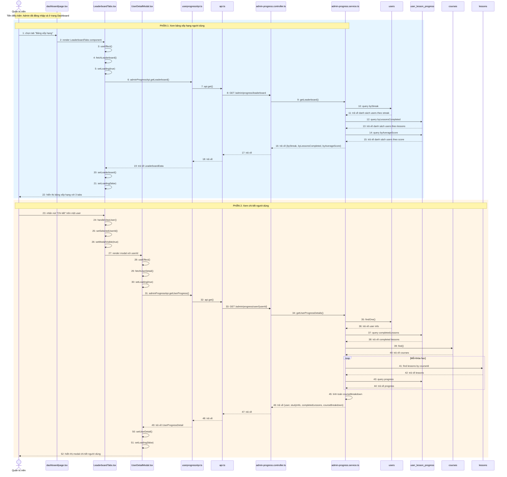

# Sequence Diagram: Xem bảng xếp hạng người dùng và Chi tiết người dùng

## Use Case: Xem bảng xếp hạng và chi tiết người dùng

### Mô tả
Admin truy cập trang Dashboard, chọn tab "Bảng xếp hạng" để xem danh sách người dùng được xếp hạng theo các tiêu chí (Streak dài nhất, Nhiều bài học nhất, Điểm cao nhất), sau đó nhấn "Chi tiết" để xem thông tin chi tiết của một người dùng.

### Sequence Diagram

---

## Tổng hợp các thành phần

### Frontend (Admin)

| File | Vai trò |
|------|---------|
| `dashboard/page.tsx` | Trang Dashboard chính, chứa các tabs |
| `LeaderboardTabs.tsx` | Component hiển thị bảng xếp hạng với 3 tabs |
| `UserDetailModal.tsx` | Modal hiển thị chi tiết người dùng |
| `userprogressApi.ts` | Service gọi API liên quan đến progress |
| `api.ts` | Core API utility functions |

### Backend (BE)

| File | Vai trò |
|------|---------|
| `admin-progress.controller.ts` | Controller xử lý các endpoints admin/progress/* |
| `admin-progress.service.ts` | Service logic nghiệp vụ cho admin progress |

### Entities

| Entity | Table | Mô tả |
|--------|-------|-------|
| `User` | `users` | Thông tin người dùng |
| `UserLessonProgress` | `user_lesson_progress` | Tiến trình học của user theo lesson |
| `Courses` | `courses` | Thông tin khóa học |
| `Lessons` | `lessons` | Thông tin bài học |

### API Endpoints

| Method | Endpoint | Mô tả |
|--------|----------|-------|
| GET | `/admin/progress/leaderboard?limit={n}` | Lấy bảng xếp hạng |
| GET | `/admin/progress/user/{userId}` | Lấy chi tiết tiến trình của user |

