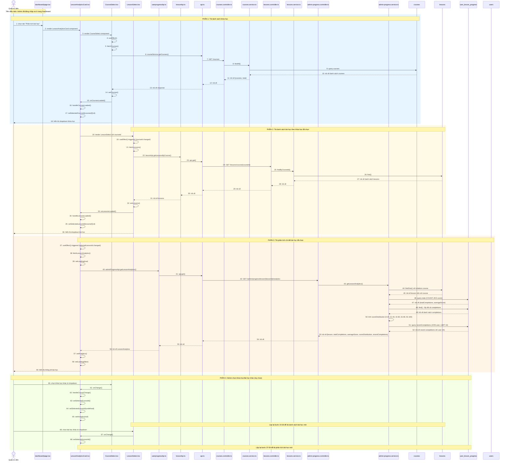

# Sequence Diagram: Xem phân tích theo bài học (Lesson Analytics)

## Use Case: Xem phân tích theo bài học

### Mô tả
Admin truy cập trang Dashboard, chọn tab "Phân tích bài học", chọn khóa học rồi chọn bài học từ dropdown để xem thống kê chi tiết bao gồm: tổng lượt hoàn thành, điểm trung bình, phân bố điểm số, và danh sách người hoàn thành gần đây.

### Sequence Diagram

---

## Tổng hợp các thành phần

### Frontend (Admin)

| File | Vai trò |
|------|---------|
| `dashboard/page.tsx` | Trang Dashboard chính, chứa các tabs |
| `LessonAnalyticsCard.tsx` | Card hiển thị phân tích bài học |
| `CourseSelect.tsx` | Component dropdown chọn khóa học |
| `LessonSelect.tsx` | Component dropdown chọn bài học |
| `userprogressApi.ts` | Service gọi API liên quan đến progress |
| `lessonApi.ts` | Service gọi API liên quan đến lessons |
| `api.ts` | Core API utility functions |

### Backend (BE)

| File | Vai trò |
|------|---------|
| `courses.controller.ts` | Controller xử lý các endpoints /courses/* |
| `courses.service.ts` | Service logic nghiệp vụ cho courses |
| `lessons.controller.ts` | Controller xử lý các endpoints /lessons/* |
| `lessons.service.ts` | Service logic nghiệp vụ cho lessons |
| `admin-progress.controller.ts` | Controller xử lý các endpoints admin/progress/* |
| `admin-progress.service.ts` | Service logic nghiệp vụ cho admin progress |

### Entities

| Entity | Table | Mô tả |
|--------|-------|-------|
| `Courses` | `courses` | Thông tin khóa học |
| `Lessons` | `lessons` | Thông tin bài học |
| `UserLessonProgress` | `user_lesson_progress` | Tiến trình học của user |
| `User` | `users` | Thông tin người dùng |

### API Endpoints

| Method | Endpoint | Mô tả |
|--------|----------|-------|
| GET | `/courses?page=1&limit=100` | Lấy danh sách khóa học |
| GET | `/lessons/course/{courseId}` | Lấy danh sách bài học theo khóa học |
| GET | `/admin/progress/lesson/{lessonId}/analytics` | Lấy phân tích chi tiết bài học |

### Dữ liệu trả về (LessonAnalytics)

| Field | Type | Mô tả |
|-------|------|-------|
| `lesson` | Object | Thông tin bài học (id, title, courseId, courseTitle) |
| `totalCompletions` | number | Tổng lượt hoàn thành |
| `averageScore` | number | Điểm trung bình (%) |
| `scoreDistribution` | Array | Phân bố điểm theo 5 khoảng (0-20, 21-40, 41-60, 61-80, 81-100) |
| `recentCompletions` | Array | 10 người hoàn thành gần nhất (userId, displayName, scorePercentage, completedAt) |
