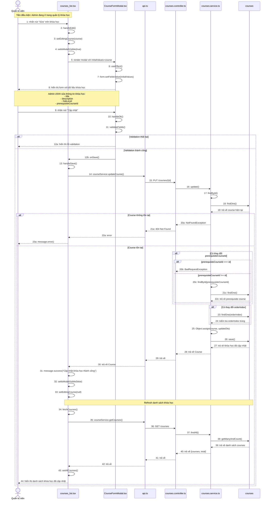

# Sequence Diagram: Chỉnh sửa khóa học (Update Course)

## Use Case: Chỉnh sửa khóa học

### Mô tả
Admin truy cập trang quản lý khóa học, nhấn nút "Sửa" trên một khóa học, chỉnh sửa thông tin trong form và lưu thay đổi.

### Sequence Diagram

---

## Tổng hợp các thành phần

### Frontend (Admin)

| File | Vai trò |
|------|---------|
| `courses_list.tsx` | Trang quản lý danh sách khóa học |
| `CourseFormModal.tsx` | Modal form tạo/sửa khóa học |
| `api.ts` | Service gọi API (courseService) |

### Backend (BE)

| File | Vai trò |
|------|---------|
| `courses.controller.ts` | Controller xử lý các endpoints /courses/* |
| `courses.service.ts` | Service logic nghiệp vụ cho courses |

### Entity

| Entity | Table | Mô tả |
|--------|-------|-------|
| `Courses` | `courses` | Thông tin khóa học |

### API Endpoints

| Method | Endpoint | Mô tả |
|--------|----------|-------|
| PUT | `/courses/{id}` | Cập nhật khóa học |
| GET | `/courses?page=1&limit=100` | Lấy danh sách khóa học |

### Dữ liệu đầu vào (UpdateCourseDto)

| Field | Type | Required | Mô tả |
|-------|------|----------|-------|
| `title` | string | ❌ | Tiêu đề khóa học |
| `description` | string | ❌ | Mô tả khóa học |
| `hskLevel` | number (1-9) | ❌ | Cấp độ HSK |
| `prerequisiteCourseId` | number | ❌ | ID khóa học tiên quyết |
| `orderIndex` | number | ❌ | Thứ tự hiển thị |
| `isActive` | boolean | ❌ | Trạng thái hoạt động |

### Validation và Logic BE

1. **Kiểm tra course tồn tại**: Tìm course theo ID, nếu không có thì throw NotFoundException
2. **Kiểm tra prerequisite course**:
   - Không cho phép course là prerequisite của chính nó
   - Nếu thay đổi prerequisiteCourseId, kiểm tra course đó có tồn tại không
3. **Kiểm tra orderIndex trùng**: Nếu thay đổi orderIndex, kiểm tra không bị trùng với course khác
4. **Merge và lưu**: Object.assign để merge dữ liệu mới, sau đó save
