# Sequence Diagram: Chỉnh sửa từ vựng (Update Word)

## Use Case: Chỉnh sửa từ vựng

### Mô tả
Admin truy cập trang quản lý từ vựng, nhấn nút "Sửa" trên một từ vựng, chỉnh sửa thông tin bao gồm pinyin, nghĩa, bản dịch và tải lên hình ảnh/âm thanh mới (tùy chọn), sau đó lưu thay đổi.

### Sequence Diagram

```mermaid
sequenceDiagram
    actor Admin as Quản trị viên
    participant WordsPageTsx as words/page.tsx
    participant WordForm as WordForm.tsx
    participant S3Upload as s3Upload.ts
    participant S3 as AWS S3
    participant TTSButton as TTSButton.tsx
    participant WordApi as wordApi.ts
    participant Api as api.ts
    participant Controller as words.controller.ts
    participant Service as words.service.ts
    participant WordEntity as words
    participant SenseEntity as word_senses
    participant TranslationEntity as word_sense_translations

    Note over Admin,WordsPageTsx: Tiền điều kiện: Admin đang ở trang quản lý từ vựng

    %% ===== PHẦN 1: MỞ FORM CHỈNH SỬA =====
    rect rgb(230, 245, 255)
    Note over Admin,WordForm: PHẦN 1: Mở form chỉnh sửa từ vựng
    
    Admin->>WordsPageTsx: 1: nhấn nút "Sửa" trên một từ
    WordsPageTsx->>WordsPageTsx: 2: setSelectedWord(word)
    WordsPageTsx->>WordsPageTsx: 3: setEditModalVisible(true)
    WordsPageTsx->>WordForm: 4: render modal với wordData=selectedWord
    WordForm->>WordForm: 5: useEffect() triggered (wordData changed)
    WordForm->>WordForm: 6: setExistingWord(wordData)
    WordForm->>WordForm: 7: tìm primarySense từ wordData.senses
    WordForm->>WordForm: 8: setSenseEditing(primarySense)
    WordForm->>WordForm: 9: setGeneratedPinyin(sense.pinyin)
    WordForm->>WordForm: 10: setUploadedImageUrl(sense.imageUrl)
    WordForm->>WordForm: 11: setUploadedAudioUrl(sense.audioUrl)
    WordForm->>WordForm: 12: form.setFieldsValue() với dữ liệu hiện tại
    WordForm-->>Admin: 13: hiển thị form với dữ liệu từ vựng
    end

    %% ===== PHẦN 2: CHỌN NGHĨA ĐỂ CHỈNH SỬA (NẾU CÓ NHIỀU NGHĨA) =====
    rect rgb(255, 250, 230)
    Note over Admin,WordForm: PHẦN 2: Chọn nghĩa để chỉnh sửa (nếu có nhiều)
    
    alt Từ có nhiều nghĩa
        Admin->>WordForm: 14: chọn nghĩa khác từ dropdown
        WordForm->>WordForm: 15: handleSenseChange()
        WordForm->>WordForm: 16: setSenseEditing(sense)
        WordForm->>WordForm: 17: cập nhật form với dữ liệu nghĩa mới
        WordForm->>WordForm: 18: setUploadedImageUrl(), setUploadedAudioUrl()
        WordForm-->>Admin: 19: hiển thị dữ liệu nghĩa đã chọn
    end
    end

    %% ===== PHẦN 3: CHỈNH SỬA THÔNG TIN =====
    rect rgb(230, 255, 230)
    Note over Admin,WordForm: PHẦN 3: Chỉnh sửa thông tin từ vựng
    
    Admin->>WordForm: 20: chỉnh sửa Pinyin
    Admin->>WordForm: 21: chọn loại từ (partOfSpeech)
    Admin->>WordForm: 22: chọn cấp HSK
    Admin->>WordForm: 23: toggle isPrimary
    Admin->>WordForm: 24: chỉnh sửa bản dịch
    Admin->>WordForm: 25: chỉnh sửa chi tiết bổ sung
    end

    %% ===== PHẦN 4: UPLOAD HÌNH ẢNH MỚI (TÙY CHỌN) =====
    rect rgb(255, 240, 230)
    Note over Admin,S3: PHẦN 4: Upload hình ảnh mới (tùy chọn)
    
    alt Admin muốn thay đổi hình ảnh
        Admin->>WordForm: 26: chọn file hình ảnh mới
        WordForm->>WordForm: 27: handleImageFileChange()
        Admin->>WordForm: 28: nhấn "Tải lên S3"
        WordForm->>WordForm: 29: handleUploadImage()
        WordForm->>S3Upload: 30: uploadImageByType()
        S3Upload->>S3: 31: upload file to S3
        S3-->>S3Upload: 32: trả về URL mới
        S3Upload-->>WordForm: 33: trả về {success, url}
        WordForm->>WordForm: 34: setUploadedImageUrl()
        WordForm-->>Admin: 35: hiển thị preview hình ảnh mới
    end
    end

    %% ===== PHẦN 5: UPLOAD ÂM THANH MỚI (TÙY CHỌN) =====
    rect rgb(255, 235, 230)
    Note over Admin,S3: PHẦN 5: Upload âm thanh mới (tùy chọn)
    
    alt Admin muốn thay đổi âm thanh
        alt Sử dụng TTS
            Admin->>TTSButton: 36a: nhấn nút TTS
            TTSButton->>TTSButton: 37a: generateTTS()
            TTSButton-->>WordForm: 38a: onAudioGenerated()
            WordForm->>WordForm: 39a: handleTTSGenerated()
            WordForm->>WordForm: 40a: setSelectedAudioFile()
        else Upload file thủ công
            Admin->>WordForm: 36b: chọn file âm thanh
            WordForm->>WordForm: 37b: handleAudioFileChange()
        end
        
        Admin->>WordForm: 41: nhấn "Tải lên S3"
        WordForm->>WordForm: 42: handleUploadAudio()
        WordForm->>S3Upload: 43: uploadAudioByType()
        S3Upload->>S3: 44: upload file to S3
        S3-->>S3Upload: 45: trả về URL mới
        S3Upload-->>WordForm: 46: trả về {success, url}
        WordForm->>WordForm: 47: setUploadedAudioUrl()
        WordForm-->>Admin: 48: hiển thị audio player mới
    end
    end

    %% ===== PHẦN 6: SUBMIT FORM =====
    rect rgb(255, 245, 230)
    Note over Admin,TranslationEntity: PHẦN 6: Lưu thay đổi vào database

    Admin->>WordForm: 49: nhấn nút "Lưu"
    WordForm->>WordForm: 50: handleSubmit()
    WordForm->>WordForm: 51: form.validateFields()
    
    alt Validation thất bại
        WordForm-->>Admin: 52a: hiển thị lỗi validation
    else Validation thành công
        WordForm->>WordForm: 52b: setLoading(true)
        WordForm->>WordForm: 53: tạo formData với uploadedImageUrl, uploadedAudioUrl
        WordForm->>WordApi: 54: updateWordSense(senseId, formData)
        WordApi->>Api: 55: api.patch()
        Api->>Controller: 56: PATCH /words/senses/{senseId}
        Controller->>Service: 57: updateCompleteBySenseId()
        
        Service->>SenseEntity: 58: findOne() với relations
        SenseEntity-->>Service: 59: trả về wordSense với word, translations
        
        alt Có cập nhật word data
            Service->>Service: 60: kiểm tra simplified conflict
            Service->>WordEntity: 61: save()
            WordEntity-->>Service: 62: trả về word đã cập nhật
        end
        
        alt Có cập nhật sense data
            Service->>SenseEntity: 63: save() với imageUrl, audioUrl mới
            SenseEntity-->>Service: 64: trả về sense đã cập nhật
        end
        
        alt Có cập nhật translation data
            alt Translation đã tồn tại
                Service->>TranslationEntity: 65a: save()
                TranslationEntity-->>Service: 66a: trả về translation đã cập nhật
            else Tạo translation mới
                Service->>TranslationEntity: 65b: create() và save()
                TranslationEntity-->>Service: 66b: trả về translation mới
            end
        end
        
        Service->>Service: 67: findById(wordId)
        Service->>WordEntity: 68: findOne() với relations
        WordEntity-->>Service: 69: trả về complete word
        
        Service-->>Controller: 70: trả về Word
        Controller-->>Api: 71: trả về
        Api-->>WordApi: 72: trả về
        WordApi-->>WordForm: 73: trả về Word
        WordForm->>WordForm: 74: message.success("Cập nhật từ vựng thành công")
        WordForm->>WordsPageTsx: 75: onSuccess()
    end
    end

    %% ===== PHẦN 7: REFRESH DANH SÁCH =====
    rect rgb(245, 255, 230)
    Note over WordsPageTsx,WordEntity: PHẦN 7: Refresh danh sách từ vựng
    
    WordsPageTsx->>WordsPageTsx: 76: handleFormSuccess()
    WordsPageTsx->>WordsPageTsx: 77: setEditModalVisible(false)
    WordsPageTsx->>WordsPageTsx: 78: setSelectedWord(null)
    WordsPageTsx->>WordsPageTsx: 79: fetchWordData()
    WordsPageTsx->>WordApi: 80: fetchWords()
    WordApi->>Api: 81: api.get()
    Api->>Controller: 82: GET /words
    Controller->>Service: 83: findAll()
    Service->>WordEntity: 84: getManyAndCount()
    WordEntity-->>Service: 85: trả về danh sách words
    Service-->>Controller: 86: trả về {words, total}
    Controller-->>Api: 87: trả về
    Api-->>WordApi: 88: trả về
    WordApi-->>WordsPageTsx: 89: trả về
    WordsPageTsx->>WordsPageTsx: 90: setWords()
    WordsPageTsx-->>Admin: 91: hiển thị danh sách từ vựng đã cập nhật
    end
```

---

## Tổng hợp các thành phần

### Frontend (Admin)

| File | Vai trò |
|------|---------|
| `words/page.tsx` | Trang quản lý danh sách từ vựng |
| `WordForm.tsx` | Form tạo/sửa từ vựng |
| `TTSButton.tsx` | Button tạo âm thanh Text-to-Speech |
| `s3Upload.ts` | Utility upload file lên AWS S3 |
| `wordApi.ts` | Service gọi API liên quan đến words |
| `api.ts` | Core API utility functions |

### Backend (BE)

| File | Vai trò |
|------|---------|
| `words.controller.ts` | Controller xử lý các endpoints /words/* |
| `words.service.ts` | Service logic nghiệp vụ cho words |

### External Services

| Service | Vai trò |
|---------|---------|
| `AWS S3` | Lưu trữ file hình ảnh và âm thanh |
| `TTS API` | Tạo âm thanh từ text (Text-to-Speech) |

### Entities

| Entity | Table | Mô tả |
|--------|-------|-------|
| `Word` | `words` | Thông tin từ (simplified, traditional) |
| `WordSense` | `word_senses` | Nghĩa của từ (pinyin, partOfSpeech, hskLevel, imageUrl, audioUrl) |
| `WordSenseTranslation` | `word_sense_translations` | Bản dịch của nghĩa (language, translation, additionalDetail) |

### API Endpoints

| Method | Endpoint | Mô tả |
|--------|----------|-------|
| PATCH | `/words/senses/{senseId}` | Cập nhật từ vựng theo sense ID |
| GET | `/words?page={p}&limit={l}` | Lấy danh sách từ vựng |

### Dữ liệu đầu vào (UpdateCompleteWordDto)

| Field | Type | Required | Mô tả |
|-------|------|----------|-------|
| `word.simplified` | string | ❌ | Chữ Hán giản thể |
| `word.traditional` | string | ❌ | Chữ Hán phồn thể |
| `sense.pinyin` | string | ❌ | Phiên âm Pinyin |
| `sense.partOfSpeech` | string | ❌ | Loại từ |
| `sense.hskLevel` | number | ❌ | Cấp độ HSK (1-9) |
| `sense.isPrimary` | boolean | ❌ | Đánh dấu nghĩa chính |
| `sense.imageUrl` | string | ❌ | URL hình ảnh minh họa (từ S3) |
| `sense.audioUrl` | string | ❌ | URL âm thanh phát âm (từ S3 hoặc TTS) |
| `translation.language` | string | ❌ | Ngôn ngữ dịch (default: "vn") |
| `translation.translation` | string | ❌ | Bản dịch |
| `translation.additionalDetail` | string | ❌ | Chi tiết bổ sung |

### Logic đặc biệt

1. **Chọn nghĩa để sửa**: Nếu từ có nhiều nghĩa, Admin có thể chọn nghĩa cần sửa từ dropdown
2. **Kiểm tra simplified conflict**: Nếu thay đổi simplified, kiểm tra không trùng với từ khác
3. **Partial Update**: Chỉ cập nhật các trường được gửi lên
4. **Auto-create translation**: Nếu chưa có translation cho ngôn ngữ "vn", tự động tạo mới
5. **Upload media**: Hỗ trợ thay thế hình ảnh và âm thanh cũ bằng file mới
6. **TTS Integration**: Có thể tạo lại âm thanh bằng TTS thay vì upload file
