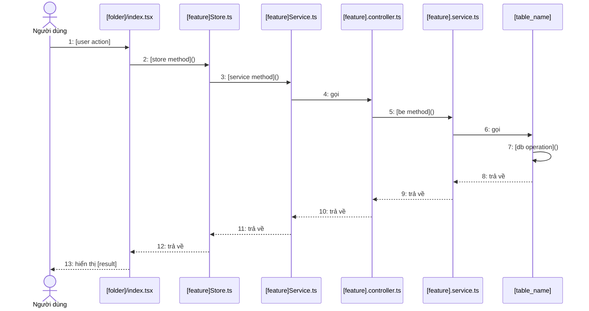

# Quy tắc tạo Sequence Diagram cho HanziiLab

## 1. Cấu trúc codebase

### Frontend (HanziiLab_FE)
- **Screens**: `app/(tabs)/[feature]/index.tsx` hoặc `app/(tabs)/[feature]/[action].tsx`
- **Stores (Zustand)**: `src/stores/[feature]Store.ts` - quản lý state
- **Services**: `src/services/[feature]Service.ts` - gọi API

### Backend (HanziiLab_BE)
- **Controllers**: `src/modules/[feature]/[feature].controller.ts` - nhận request
- **Services**: `src/modules/[feature]/[feature].service.ts` - business logic
- **Repositories**: TypeORM entities trong `entities/`

## 2. Flow điều tra code

1. **Xác định màn hình FE**: Tìm file `.tsx` trong `app/(tabs)/`
2. **Xem outline**: Dùng `view_file_outline` để tìm các hàm handler
3. **Xem chi tiết hàm**: Dùng `view_code_item` cho các hàm quan trọng
4. **Tìm store**: Xem store tương ứng trong `src/stores/`
5. **Tìm service**: Xem service tương ứng trong `src/services/`
6. **Tìm BE controller**: Xem controller trong `src/modules/[feature]/`
7. **Tìm BE service**: Xem service trong `src/modules/[feature]/`

## 3. Format Mermaid theo yêu cầu user

### Quy tắc naming
- Actor: `actor Khách as Người dùng`
- Participants: Dùng tên file ngắn gọn, ví dụ: `participant ProfileTsx as profile/index.tsx`
- Gọi hàm: `function()` - không ghi tham số chi tiết
- Gọi API: Dùng `gọi` thay vì ghi HTTP method

### Quy tắc đánh số
- Đánh số liên tục: `1:`, `2:`, `3:`...
- Với parallel: `4a:`, `4b:`, `5a:`, `5b:`...

### Quy tắc arrows
- Request: `A->>B: 1: action()`
- Response: `A-->>B: 2: trả về`
- Self-call: `A->>A: 3: internalMethod()`

### Blocks đặc biệt
```
loop Lặp cho đến hết [condition]
    ...
end

par Tải song song
    ...
and
    ...
end

Note over A,B: Ghi chú
```

## 4. Template chuẩn



## 5. Các use case đã hoàn thành

| Use Case | File tham khảo |
|----------|----------------|
| Đăng nhập | login_sequence_diagram.md |
| Đăng ký | registration_sequence_diagram.md |
| Xem chi tiết khóa học | course_sequence_diagram.md |
| Xem chi tiết bài học | lesson_sequence_diagram.md |
| Học bài (có loop) | Xem chat history |
| Chat AI trang chính | Xem chat history |
| Chat AI trong bài học | Xem chat history |
| Chỉnh sửa hồ sơ | Xem chat history |
| Ôn tập (có loop) | Xem chat history |
| Xem thống kê ôn tập (có parallel) | Xem chat history |

## 6. Key files quan trọng

### Auth flow
- FE: `app/(auth)/login.tsx`, `app/(auth)/register.tsx`
- FE: `src/services/authService.ts`, `src/stores/authStore.ts`
- BE: `src/modules/auth/auth.controller.ts`, `auth.service.ts`

### Lesson flow
- FE: `app/(tabs)/home/learning/course/[courseId]/lesson/[lessonId]/`
- FE: `src/stores/lessonStore.ts`, `src/services/lessonService.ts`
- BE: `src/modules/lessons/`, `src/modules/courses/`

### AI Chat flow
- FE: `app/(tabs)/ai/index.tsx` (standalone)
- FE: `app/(tabs)/home/learning/.../ai-chat/index.tsx` (in-lesson)
- FE: `src/services/ragService.ts`
- BE: `src/modules/rag/`

### Review flow
- FE: `app/(tabs)/revise/`
- FE: `src/stores/reviewStore.ts`, `src/services/reviewService.ts`
- BE: `src/modules/srs/`

### Profile flow
- FE: `app/(tabs)/profile/index.tsx`
- FE: `src/services/userService.ts`
- BE: `src/modules/users/`

## 7. Lưu ý đặc biệt

1. **Omit chi tiết**: Không ghi tham số hàm, HTTP methods, hash(), token
2. **Focus vào flow**: Tập trung vào sequence giữa các component
3. **Giải thích kèm theo**: Sau mermaid luôn có bảng giải thích
4. **Vietnamese labels**: Dùng tiếng Việt cho mô tả actions


